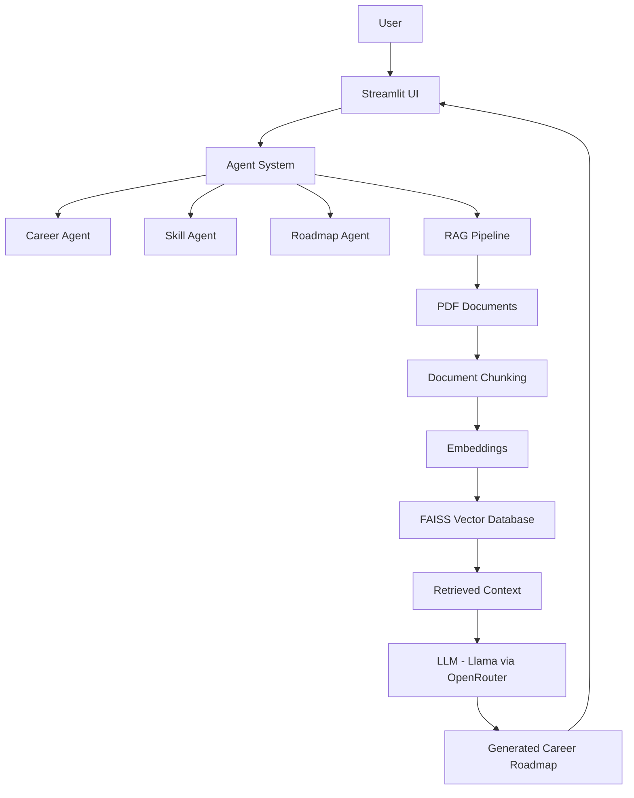
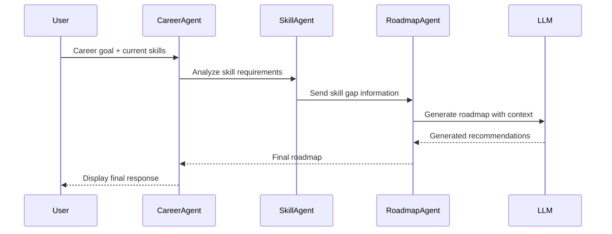

#  IT Career Roadmap Assistant

An Agentic AI-powered application that provides personalized IT career guidance using Large Language Models (LLMs), multiple AI agents, and Retrieval-Augmented Generation (RAG).

The system analyzes a user's target career, current skills, and learning goals to generate a personalized roadmap including required skills, learning resources, and project recommendations.

---

#  Project Description

Choosing an IT career path can be challenging due to rapidly changing technologies and a large number of available career options.

The **IT Career Roadmap Assistant** solves this problem by combining:

- Agentic AI architecture
- Retrieval-Augmented Generation (RAG)
- Domain-specific IT career documents
- Large Language Models
- Vector similarity search

The application provides:

- Career path recommendations
- Skill gap analysis
- Learning roadmap generation
- Project suggestions
- Personalized IT career guidance

---

#  System Architecture



---

#  Agentic Design Patterns

This project implements multiple agentic AI design patterns.

## 1. Planning / Task Decomposition Pattern

**Location:**

```
agents/roadmap_agent.py
```

The Roadmap Agent breaks down a career goal into smaller tasks:

- Required technical skills
- Learning stages
- Recommended projects
- Career milestones

---

## 2. Router / Orchestrator Pattern

**Location:**

```
agents/career_agent.py
```

The Career Agent works as an orchestrator.

It routes user requirements to specialized agents:

```
User Request
      |
      v
Career Agent
      |
      +---- Skill Agent
      |
      +---- Roadmap Agent
```

---

## 3. Reflection / Self-Critique Pattern

**Location:**

```
agents/skill_agent.py
```

The Skill Agent reviews recommendations and identifies:

- Missing skills
- Improvement areas
- Skill gaps

This improves the final generated roadmap.

---

#  Agent-to-Agent Communication

Multiple agents exchange structured information to complete the task.



---

#  Model Selection Strategy

The application uses different models for different tasks instead of using one model for everything.

| Task | Model | Provider | Reason |
|---|---|---|---|
| Intent understanding / routing | Llama 3.1 8B | OpenRouter | Low latency and efficient for simple decisions |
| Final career roadmap generation | Llama 3.3 70B | OpenRouter | Better reasoning and high-quality responses |
| Text embeddings | Sentence Transformers | Local | Free and optimized for semantic search |

---

## Model Comparison

| Model | Latency | Cost | Context Window | Reasoning Quality |
|---|---|---|---|---|
| Llama 3.1 8B | Low | Low | Medium | Good for classification |
| Llama 3.3 70B | Medium | Higher | Large | Strong reasoning ability |
| Sentence Transformers | Very Low | Free | N/A | Good embedding performance |

---

#  RAG Pipeline

The system uses Retrieval-Augmented Generation (RAG) to provide accurate career recommendations based on IT-related documents.

---

## Document Corpus

The system contains 20+ IT career-related documents.

Examples:

- Software Engineering career guides
- Cloud Computing resources
- DevOps learning guides
- Python learning materials
- UX/UI career documents

Documents location:

```
data/documents/
```

---

# RAG Workflow

```
PDF Documents

      |
      v

Document Loader

      |
      v

Text Chunking

      |
      v

Embedding Generation

      |
      v

FAISS Vector Database

      |
      v

Similarity Retrieval

      |
      v

LLM Response Generation
```

---

# Document Chunking Strategy

Large documents are divided into smaller chunks.

Strategy:

- Chunk size: 500-1000 characters
- Overlapping chunks are used
- Each chunk maintains important context

Benefits:

- Better retrieval accuracy
- Faster similarity search
- Improved LLM responses

---

# Embedding Model

Embedding generation is performed using:

```
Sentence Transformers
```

The model converts text chunks into numerical vector representations.

These vectors allow semantic similarity searching.

---

# Vector Database

The project uses:

```
FAISS
```

FAISS provides efficient similarity search over document embeddings.

---

# Retrieval Evaluation

Five sample queries were tested.

| Query | Retrieved Documents | Result |
|---|---|---|
| How to become a DevOps Engineer? | DevOps career guides | Relevant |
| AI Engineer learning roadmap | AI/ML documents | Relevant |
| Frontend developer skills | Web development documents | Relevant |
| Cloud Engineer roadmap | Cloud computing documents | Relevant |
| Python beginner learning path | Python documents | Relevant |

---

#  Application Interface

The application is developed using:

```
Streamlit
```

Users can:

1. Select target career
2. Enter current skills
3. Generate personalized roadmap

---

#  Project Structure

```
IT-Career-Roadmap-Assistant

│
├── app.py
│
├── agents
│   ├── career_agent.py
│   ├── skill_agent.py
│   └── roadmap_agent.py
│
├── rag
│   ├── loader.py
│   ├── chunker.py
│   ├── embeddings.py
│   ├── vectorstore.py
│   └── retriever.py
│
├── services
│   └── llm.py
│
├── data
│   └── documents
│
├── tests
│
├── requirements.txt
│
└── README.md
```

---

#  Setup Instructions

## 1. Clone Repository

```bash
git clone https://github.com/Imalsha-Dilshani/IT-Career-Roadmap-Assistant.git
```

---

## 2. Create Virtual Environment

```bash
python -m venv venv
```

Activate:

Windows:

```bash
venv\Scripts\activate
```

---

## 3. Install Dependencies

```bash
pip install -r requirements.txt
```

---

## 4. Configure API Key

Create:

```
.streamlit/secrets.toml
```

Add:

```toml
OPENROUTER_API_KEY="your_api_key"
```

API keys are never stored in source code.

---

## 5. Run Application

```bash
streamlit run app.py
```

---

#  Live Streamlit Demo

```
https://it-career-roadmap-assistant-fscegjrtdapv6atxehemjn.streamlit.app/
```

---

#  Secrets Management

Security practices:

- API keys stored using Streamlit Secrets
- No API keys committed to GitHub
- `.gitignore` prevents sensitive files from being uploaded

Ignored files:

```
.env
.streamlit/secrets.toml
__pycache__
venv/
```

---

#  Testing

The project includes testing for:

- Agent functionality
- RAG retrieval pipeline

Testing files:

```
tests/
 ├── test_agents.py
 └── test_rag.py
```

---

#  Known Limitations

- Response quality depends on available documents.
- Free API models may have rate limitations.
- Current system focuses mainly on IT career paths.
- Large document collections may increase retrieval time.
- Agent communication is implemented using a custom protocol.

---

#  Development Workflow

Feature branches were used:

```
main

feature/rag-pipeline

feature/agent-system

feature/model-selection

feature/testing

feature/documentation

streamlit-site
```

Changes were merged through Pull Requests.

---

# 📝 Commit Convention

Semantic commit messages were used:

Examples:

```
feat: add rag pipeline

fix: resolve llm service error

docs: update README documentation

test: add agent tests

refactor: improve code structure
```

---

#  Future Improvements

- Add user authentication
- Improve multi-agent collaboration
- Add career progress tracking
- Support more IT domains
- Improve retrieval ranking

---

#  Author

**Imalsha Dilshani**

IT Undergraduate Student